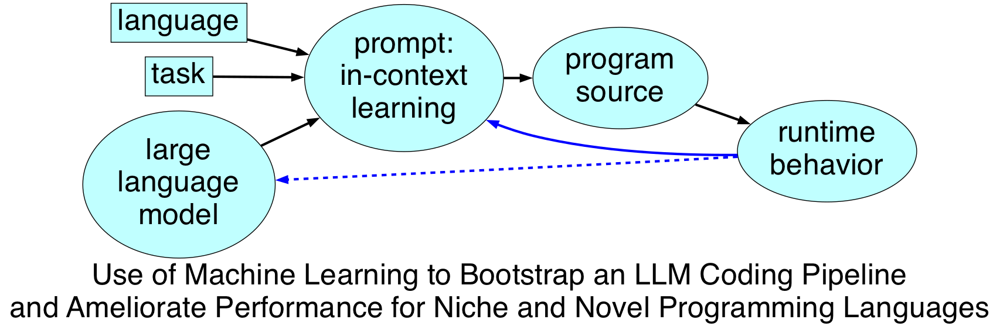

## Stunning Robot

Stunning Robot was an experiment in wrangling LLMs to generate valid algorithmic code in novel and out-of-distribution languages.

Some of it can be run directly against Cerebras as an inference provider, and otherwise it uses [DSPy](https://dspy.ai); the basic approach was to hold a small set of languages and algorithms (targets and tasks) fixed, then explore what architectural changes improved objectively measured code generation.

These [presentations](https://davelongpresentations.rcdis.co/) covering my experiences:
- Claude vs. Little Bobby Tables
- ML to bootstrap an LLM coding pipeline

were given at the [Recurse Center](https://www.recurse.com/) during the Fall 1 2025 batch.

## takeaways: the bitter lesson

- A strong model and good language documentation had far, far, more of an effect on output than varying agent architecctures.

- The more your "novel" language looks like JavaScript, the more likely LLMs will be to generate cromulent code.

- Claude Code does no better than the Claude API on out-of-distribution codegen, but costs 5x as much.

## architecture

